<div align="center">
  <h1>Swiggy Sales, Performance &amp; Customer Analysis</h1>
  <p><b>End-to-end SQL data cleaning, analysis and business insight generation using MySQL</b></p>
  <p>
    
    
    
  </p>
</div>

---

## 1. Project Overview

This project uses **MySQL** to transform a raw Swiggy food-delivery dataset into a cleaned relational database and then answer practical business questions around **sales, performance, customer behavior, segmentation, retention and revenue concentration**.

The workflow follows an end-to-end analytics process:

**Raw xlsx data -> Raw CSV data → Database design → Data validation & cleaning → Relational integrity → SQL analysis → Business insights**

The emphasis is on analytical SQL rather than simply demonstrating syntax. Queries make use of **joins, aggregations, CTEs, `CASE`, subqueries and window functions** to answer business-oriented questions.

---

## 2. Dataset Description

The **Swiggy Sales and Ratings Dataset** provides a view of performance, customer behavior and sales patterns within a food-delivery environment. The data contains information on customers, orders, restaurants, menu items and ratings, making it possible to study revenue trends, customer segments, restaurant performance and market patterns.

**Dataset Source:** [Kaggle – Sales Orders Zomato Data](https://www.kaggle.com/datasets/shermandata/sales-orders-zomato-data)

For this project, the working schema contains six source tables:

| Table | Purpose |
|---|---|
| `users` | Customer demographics such as age, gender, marital status and occupation |
| `orders` | Order date, quantity, sales amount, customer and restaurant references |
| `restaurant` | Restaurant identity, city, cuisine, ratings, rating counts and location details |
| `menu` | Restaurant menu items, cuisines and item prices |
| `food` | Food item master data and veg/non-veg classification |
| `orders_type` | Order-type information (`Veg`, `Non-Veg`, `Other`) |

### Dataset size

| Table | Raw rows | Cleaned rows |
|---|---:|---:|
| `food` | 371,560 | 371,552 |
| `menu` | 1,048,575 | 1,047,370 |
| `orders` | 150,281 | 150,281 |
| `orders_type` | 150,281 | 150,281 |
| `restaurant` | 148,540 | 148,540 |
| `users` | 100,000 | 100,000 |


---

## 3. Data Cleaning & Preparation

The raw CSVs were loaded into MySQL and validated column by column before analysis.

Key cleaning work included:

- Removing 8 completely blank rows from `food`.
- Removing 1,205 orphaned `menu` rows whose food IDs no longer existed after cleaning `food`.
- Converting date, quantity, price, rating and sales columns to appropriate numeric/date types.
- Converting placeholder ratings such as `--` and blank values to `NULL` rather than treating them as a real rating.
- Converting zero menu prices and invalid/placeholder sales amounts to `NULL` where appropriate for analysis.
- Cleaning missing restaurant names, cuisines, addresses and rating counts.
- Standardizing gender values to `M` / `F`.
- Validating age ranges and categorical domains.
- Adding primary keys and verified foreign keys.
- Creating an index on `orders.order_date` for date-based analysis.

### Verified relationships

- `users.user_id → orders.user_id`
- `restaurant.id → orders.r_id`
- `restaurant.id → menu.r_id`
- `food.f_id → menu.f_id`

The `orders_type` table is intentionally kept separate in the analysis because the current `orders` table does **not** contain an `Order_Id` column to establish a verified join.

---

## 4. Database Schema (ERD)

<p align="center">
  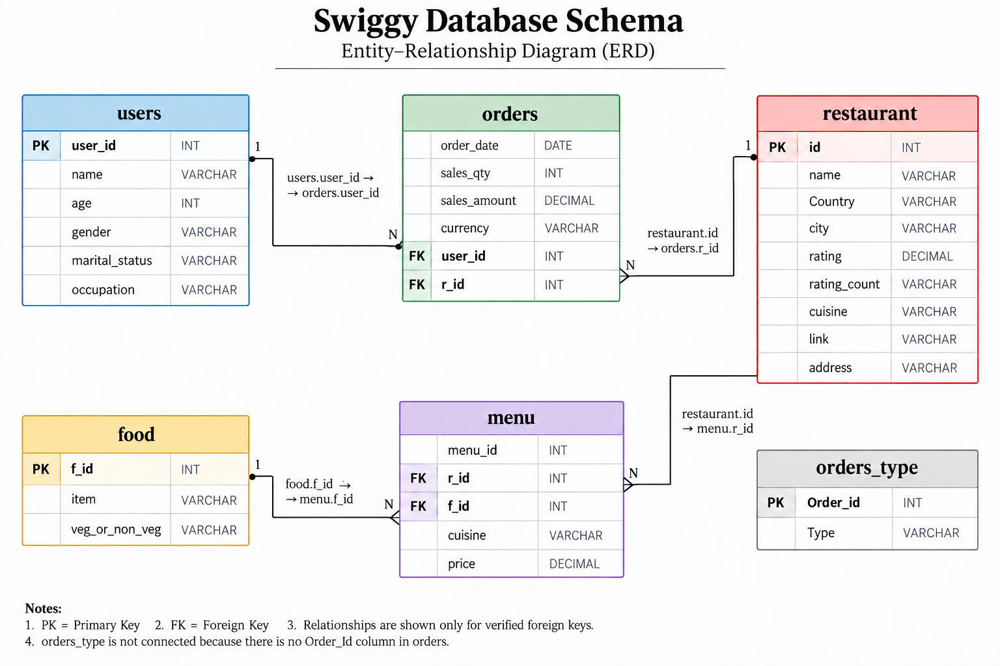
</p>

The ERD shows the verified primary/foreign-key relationships used throughout the analysis. `orders` is the central transactional table, while `users` and `restaurant` provide customer and restaurant context. `menu` connects restaurants to food items and prices.

---

## 5. Business Questions Answered

The project focuses on questions that a restaurant / food-delivery analytics team could realistically investigate:

1. **What are total and average sales, and how do they trend month over month?**
2. **Which restaurants generate the most revenue, and what does their rating profile look like?**
3. **What does order-value distribution look like — are sales driven by small orders or high-value orders?**
4. **Which cities have the highest restaurant counts and how does order volume compare?**
5. **Who are the highest-spending customers?**
6. **Which customer demographic segments generate the most revenue?**
7. **Do repeat customers account for more revenue than one-time customers?**
8. **How concentrated is revenue among the top 1%, 5% and 10% of customers?**

---

## 6. Analysis & Results

### 6.1 Monthly Revenue Trend

The analysis uses monthly revenue, average order value and month-over-month percentage changes.

Key observations from the dataset:

- Revenue shows several sharp month-to-month movements rather than a smooth trend.
- The largest positive monthly revenue jump occurs in **July 2019 (+38.45%)**.
- Revenue declines consistently from **March to June 2020**, with the steepest monthly decline in June (**-36.83%**).
- The January pattern is not consistent enough across all years to claim a strong seasonal effect from this dataset alone.

<p align="center">
  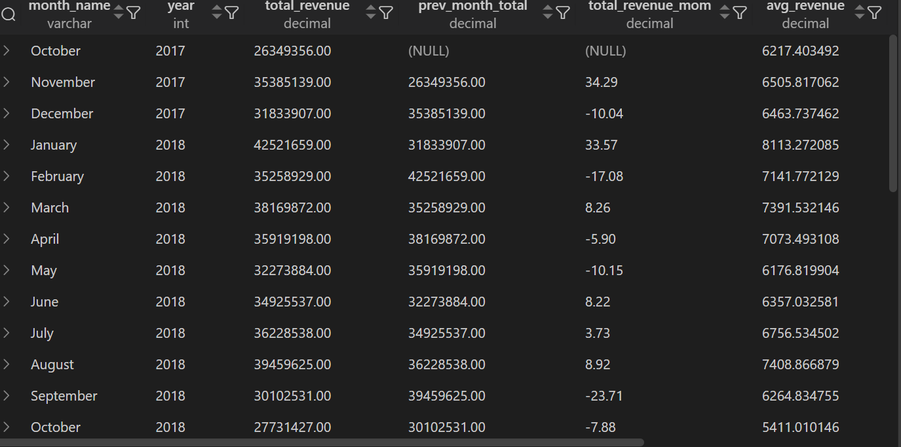
</p>

---

### 6.2 Restaurant Revenue & Rating Context

The top 10 restaurants by recorded sales generated a combined **₹136,446,661**, approximately **13.83% of total revenue**.

The rating analysis also highlights a major data-quality limitation: approximately **86,151 of 148,540 restaurants (~58%) have NULL ratings**. Because missing ratings dominate the restaurant population, the dataset does not support a clean conclusion that higher ratings directly correspond to higher revenue.

<p align="center">
  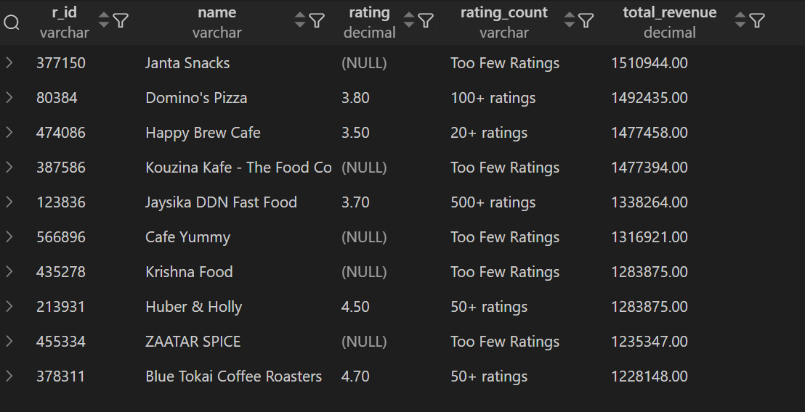
</p>

<p align="center">
  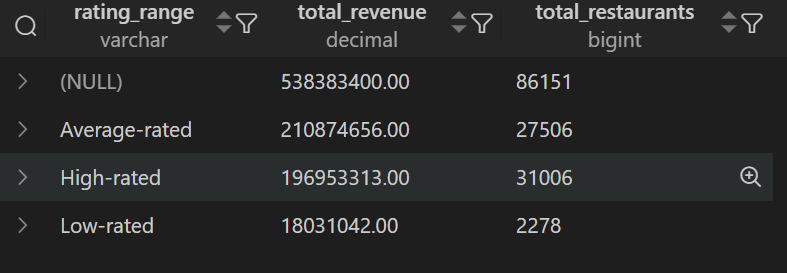
</p>

---

### 6.3 Order Value Distribution

The sales distribution is heavily skewed toward larger order values.

- Orders below **₹500** account for about **49.05% of orders** but only **1.50% of revenue**.
- Orders of **₹2,500+** account for about **27.44% of orders** and approximately **94.30% of revenue**.
- The lower-value order groups together account for most of the order count but a very small share of revenue.

This indicates that the revenue profile is dominated by high-value transactions in this dataset.

<p align="center">
  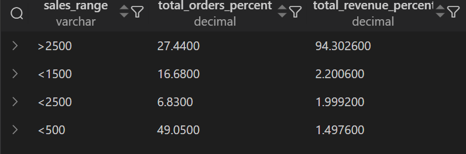
</p>

---

### 6.4 Customer Segmentation

Customer revenue was segmented using:

**Age + Gender + Marital Status + Occupation**

The top three revenue-generating demographic combinations are concentrated among **22–23-year-old students**, and together they contribute approximately **23.10% of total revenue**.

<p align="center">
  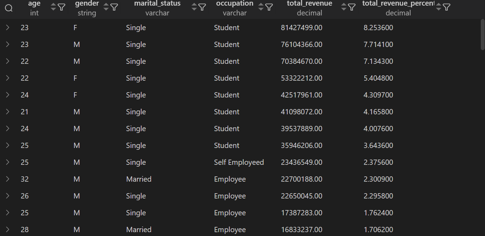
</p>

<p align="center">
  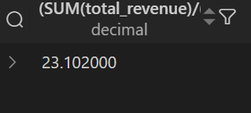
</p>

---

### 6.5 Repeat vs One-Time Customers

The analysis classifies users based on their order frequency and compares the revenue associated with one-time versus repeat customers.

**Orders placed by repeat customers account for approximately 78.39% of total revenue**, while orders associated with one-time customers account for approximately 21.61%.

A useful caution is that the `COUNT(*)` output in the original query represents **orders in each group**, not the number of distinct customers. The revenue split itself is still valid for the stated classification.

<p align="center">
  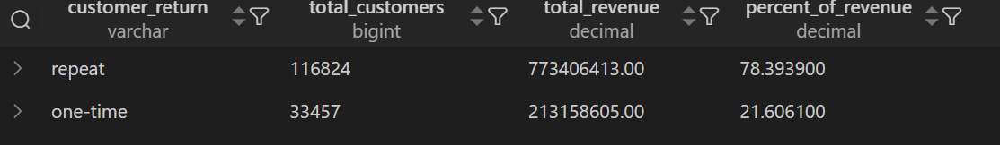
</p>

---

### 6.6 Top Spenders

The highest-spending customers were identified by aggregating sales at the `user_id` level.

The top 10 customers together contribute approximately **1.38% of total revenue**.

<p align="center">
  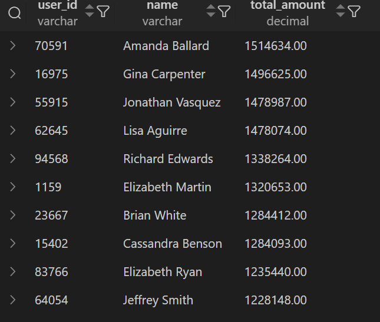
</p>

<p align="center">
  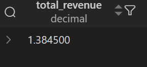
</p>

---

### 6.7 Customer Revenue Concentration

A broader concentration analysis was performed using customer-level revenue and `ROW_NUMBER()` ranking.

| Customer group | Revenue share |
|---|---:|
| Top 1% | **24.89%** |
| Top 5% | **53.76%** |
| Top 10% | **69.38%** |

This shows that revenue is substantially more concentrated when looking beyond only the top 10 customers.

<p align="center">
  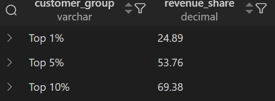
</p>

---

### 6.8 City Analysis

The city analysis compares restaurant supply with recorded order volume.

The highest-volume cities in the output also have the highest restaurant counts, with the displayed `orders_per_restaurant` value around **1.0**. This is primarily a limitation of the dataset structure rather than a robust market-demand measure, so the result should not be interpreted as proof that those cities have equal demand per restaurant.

<p align="center">
  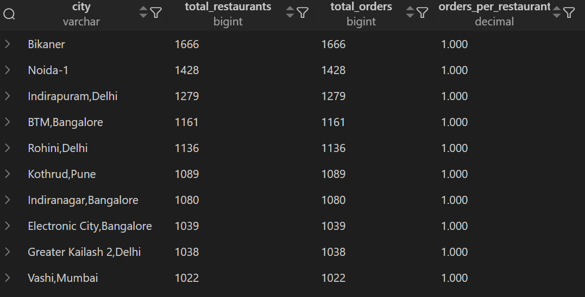
</p>

---

## 7. Key Business Insights

### Revenue

- Revenue is highly concentrated in high-value orders.
- The **₹2,500+ order group contributes ~94.3% of revenue** while representing ~27.4% of orders.
- Monthly performance contains several pronounced spikes and declines, suggesting that further investigation into promotions, operational changes and external events would be useful.

### Customers

- Repeat-customer orders contribute **~78.39% of revenue**.
- The top 10 customers contribute only **~1.38%**, but the broader top 1% / 5% / 10% customer groups account for **24.89% / 53.76% / 69.38%** respectively.
- The largest demographic revenue segments are concentrated among **22–23-year-old students**.

### Restaurants

- The top 10 restaurants contribute **~13.83% of total revenue**.
- A large majority of restaurants have missing ratings, which limits rating-vs-revenue analysis.
- Restaurant-level performance can be explored further using city, cuisine, rating count and menu pricing.

---

## 8. SQL Concepts Demonstrated

This project applies practical SQL skills used in data analytics:

- `SELECT`, `WHERE`, `ORDER BY`, `LIMIT`
- `GROUP BY` and `HAVING`
- `SQL joins`
- `Subqueries`
- CTEs (`WITH`)
- `CASE` expressions
- Aggregations: `SUM`, `AVG`, `COUNT`, `COUNT(DISTINCT ...)`
- `Date and numeric functions`
- Window functions: `LAG`, `ROW_NUMBER`
- `Percentage and revenue-share` calculations
- Data validation and cleaning
- `Primary keys`, `foreign keys` and `indexes`

---

## 9. Project Structure

```text
swiggy-sql-analysis/
│
├── README.md
├── sql/
│   ├── create_and_load.sql
│   ├── data_cleaning.sql
│   └── data_analysis.sql
│
└── assets/
    ├── erd.png
    ├── mom.png
    ├── distribution.png
    ├── restaurant_rating1.png
    ├── restaurant_rating2.png
    ├── cities_restaurants.png
    ├── customers_segment1.png
    ├── customers_segment2.png
    ├── repeat_customers.png
    ├── top_spenders1.png
    ├── top_spenders2.png
    └── top%_spenders.png
```

---

## 10. How to Run

### Prerequisites

- MySQL 8+
- MySQL Workbench or another MySQL client
- The original CSV dataset files

### Steps

1. Run `xlsx_to_csv.py` file to convert the `xlsx` files to `csv` format.
2. Update the `LOAD DATA LOCAL INFILE` file paths in `sql/create_and_load.sql` to match your machine.
3. Run `create_and_load.sql` to create the database and load the raw CSVs.
4. Run `data_cleaning.sql` to validate, clean and constrain the data.
5. Run `data_analysis.sql` to reproduce the business analyses.

> Make sure `LOCAL INFILE` is enabled in your MySQL setup if you use the provided import statements.

---

## 11. Limitations & Analytical Notes

- The dataset does not provide a verified `Order_Id` inside the main `orders` table, so `orders_type` is not joined to sales at order level.
- Missing restaurant ratings are substantial, so rating/revenue relationships should be interpreted cautiously.
- The city-level order-to-restaurant metric is constrained by the structure of the supplied orders data and should not be treated as a complete demand indicator.
- The dataset contains sales and rating information but does not directly provide a validated review-text corpus for sentiment analysis in this project.

---
